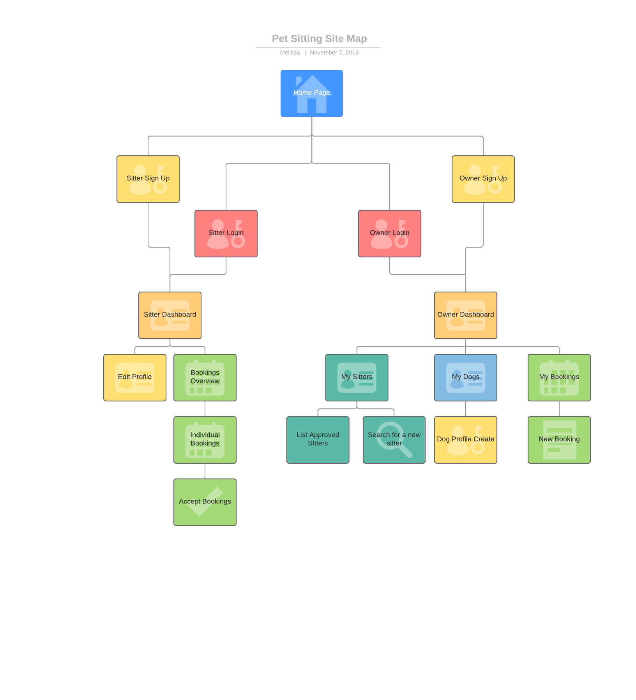
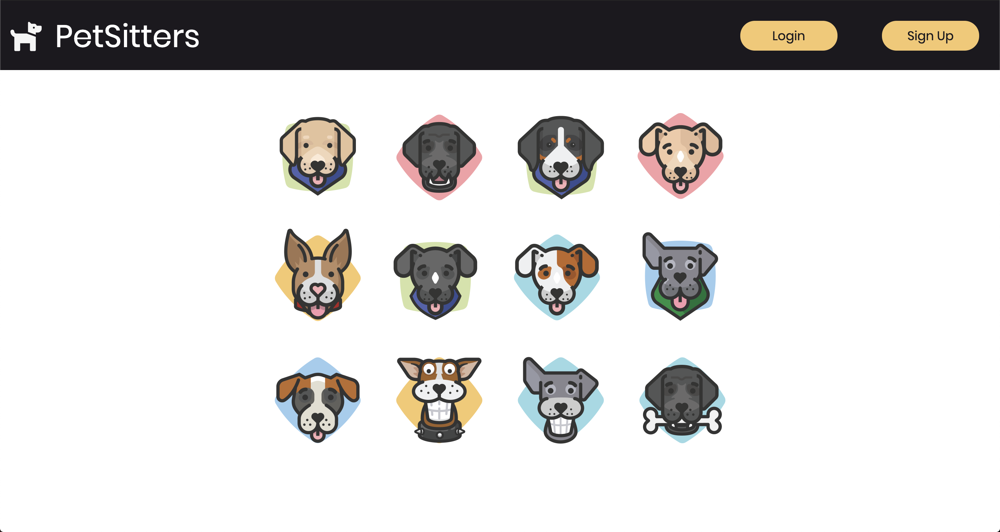
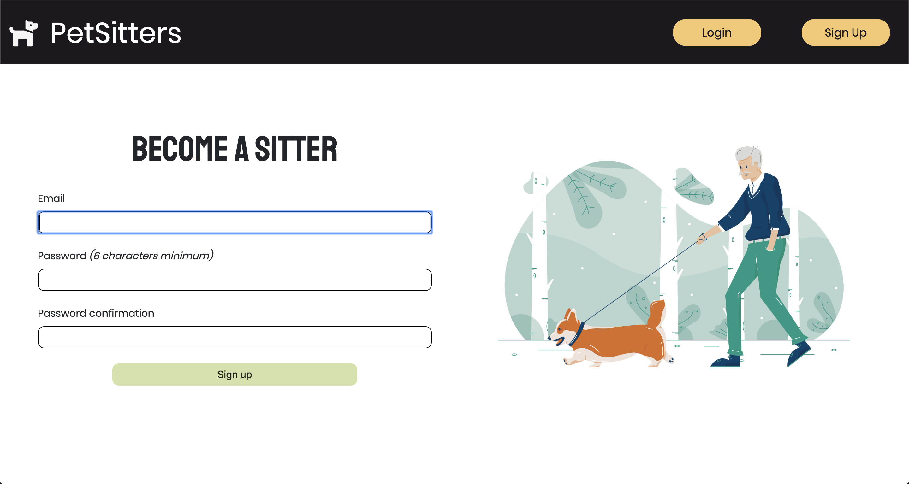
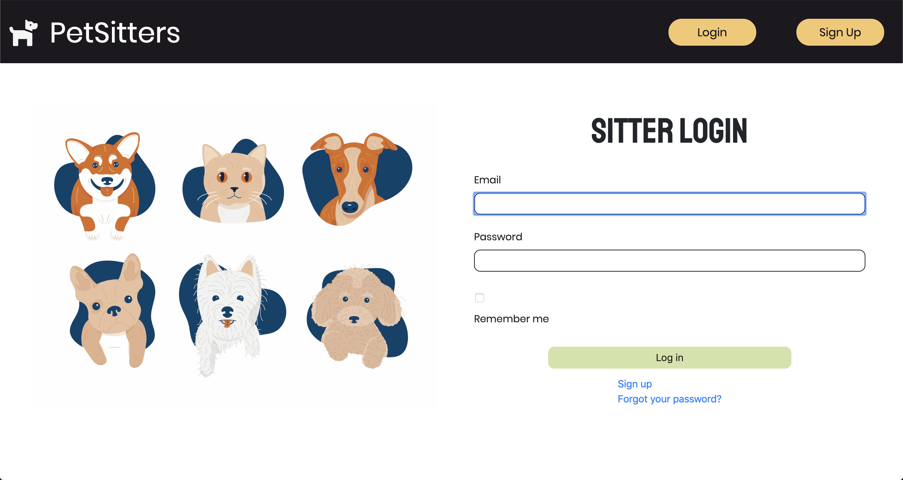
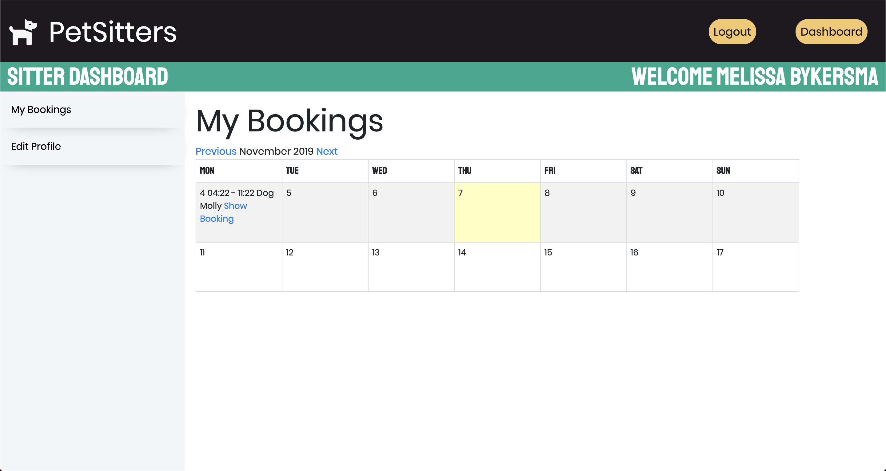
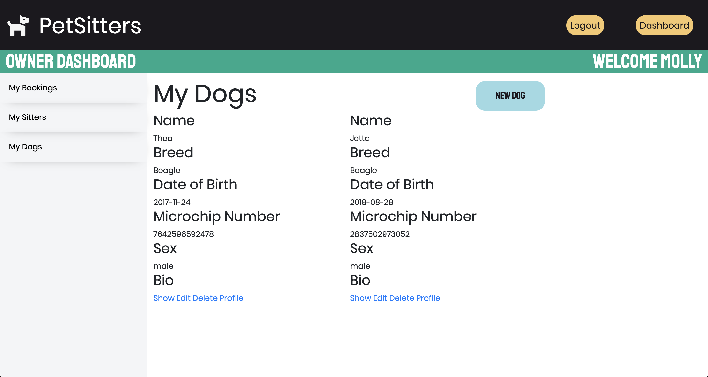
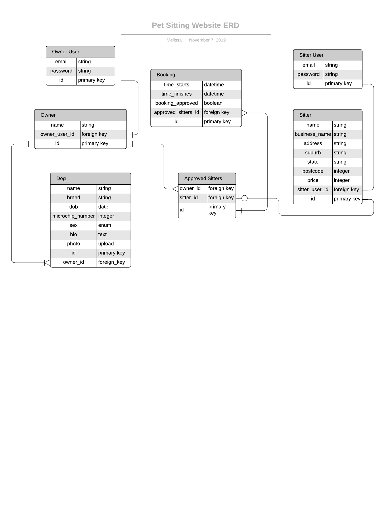
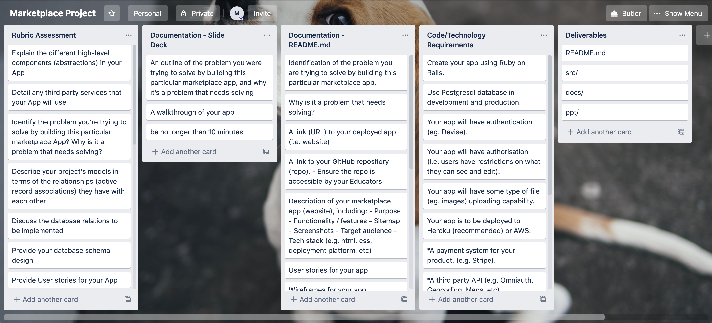

# Pet Sitting Website

Website: [PetSittingWebsite](https://enigmatic-wildwood-24997.herokuapp.com/)

GitHub: [PetSittingWebsite.github](https://github.com/MelB-24/pet-sitting-app)

### Identification of the problem you are trying to solve by building this particular marketplace app.

This marketplace website I am building is a Pet Sitting app that allows users to sign up to watch dogs or owners to send their dogs to a sitter. Although there are a few services that allow this, there is not one that is well known and used in Australia. 

## Why is it a problem that needs solving?

The pet business is one of the biggest growing industries in the world, including pet food, grooming, day care and more. There are a few websites such as this overseas however none are that well known in Australia. A website like this could be changed to suit a clients needs including making it into a singular businesses website for doggy day care to allow their clients to book their dogs into day care. A website like this one could become very big in Australia with the ever growing pet industry. 

## Description of your marketplace app (website), including:
- Purpose

The purpose of my website is to allow a person who would like to pet sit dogs sign up to the site to make it very easy for them to find clients. Owners of dogs can also sign up on the website to easily find sitters in their area to send their dogs to. 

- Functionality / features

Features of my website include owners creating their own profile as well as a profile for each of their pets. Owners can view all the sitters that are signed up to the website and in future would like to be able to search via names, area and price. They can view a calender and can start to make a booking via a sitter that they have previously approved to pet-sit. Sitters can view their calender of bookings that their owners have made and choose whether they approve the booking based on availability etc. By not approving a booking, in future I would like to implement an email system that notifies an owner if a sitter cannot approve the booking. 

- Sitemap

- Screenshots

- Target audience

The audiences targeted for my website are owners of pets looking for people to look after their dogs and people who would like to earn some money pet sitting. 

- Tech stack (e.g. html, css, deployment platform, etc)

Used in this website is Ruby on Rails. The website has been deployed on Heroku. 

## User stories for your app

## Wireframes for your app

## An ERD for your app

## Explain the different high-level components (abstractions) in your app

1. Active Record - active record is what is referred to as the M or Model the MVC. Active record is responsible for the data and the creation of objects while storing in the database. 

## Detail any third party services that your app will use

In the start I had intended to use stiripe for payment services, but due to time restraints I wasn't able to implement this feature. I have used AWS to store the images that a user uploads when they create a dogs profile. Other third party services that I would like to implement is MailGun, I would like this to be used in conjuction with bookings, for an email to be sent to a sitter when a booking is made and an email sent to the owner when a sitter approves their booking. The gems used in this website are devise and simple calender. Devise was used to allow the users to login and have their own profile in accordance to the role they are logged in as. I have used the simple calendar gem to show the users bookings to them in a easy to read format instead of an unordered messy list. I made a start on using bootstrap however I found it quite hard to implement so I had ended up doing the majority of the css styling myself. 

## Describe your projects models in terms of the relationships (active record associations) they have with each other

## Discuss the database relations to be implemented in your application

## Provide your database schema design

## Describe the way tasks are allocated and tracked in your project

In this app I sorted tasks into Tech, README, and Slideshow lists in a trello board. I used these lists to tick off one by one what I had completed. 

Explain the different high-level components (abstractions) in your App - 
1. Active Record
Product.all - becomes select all from Products
layer on top of sql - compiling into ruby
2. Active Storage 
3. form helpers
4. Devise

relations has_many

2. migration, foreign_keys, tables ERD

integer because do math

